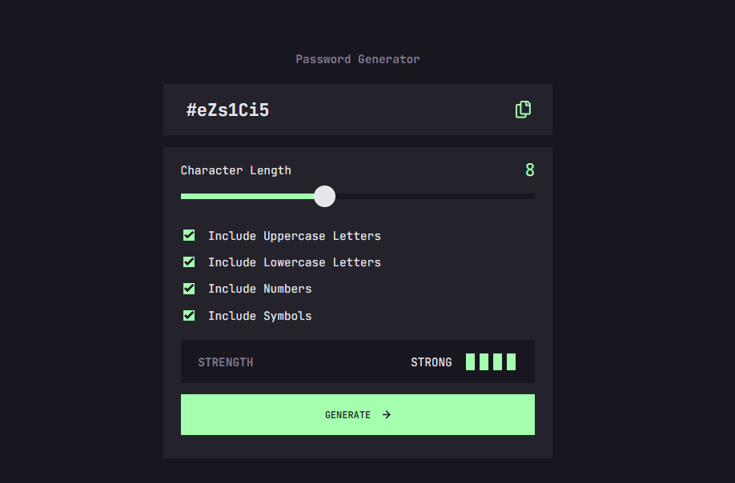

# Frontend Mentor - Password generator app solution

This is a solution to the [Password generator app challenge on Frontend Mentor](https://www.frontendmentor.io/challenges/password-generator-app-Mr8CLycqjh). Frontend Mentor challenges help you improve your coding skills by building realistic projects. 

## Table of contents

- [Overview](#overview)
  - [The challenge](#the-challenge)
  - [Screenshot](#screenshot)
  - [Links](#links)
  - [Running the app](#running-the-app)
- [My process](#my-process)
  - [Built with](#built-with)
  - [What I learned](#what-i-learned)
- [Author](#author)

## Overview

### The challenge

Users should be able to:

- Generate a password based on the selected inclusion options
- Copy the generated password to the computer's clipboard
- See a strength rating for their generated password
- View the optimal layout for the interface depending on their device's screen size
- See hover and focus states for all interactive elements on the page

### Screenshot



### Links

- Solution URL: [GitHub - https://github.com/Eugene-ak/Password-Generator.git](https://github.com/Eugene-ak/Password-Generator.git)
- Live Site URL: [Add live site URL here](https://your-live-site-url.com)

### Running the app

To start the development server, use the command `npm run dev`

To build the application for production mode, use `npm run build`

## My process

### Built with

- Typescript
- [Vite](https://vitejs.dev/guide/) - Framework
- [React](https://reactjs.org/) - JS library
- [Styled Components](https://styled-components.com/) - For styles

### What I learned

- This project has taught me how to use styled components for styling in react applications. Below is an     example snippet;
```css
import styled from "styled-components";

export const StyledHeader = styled.h4`
  width: 540px;
  margin: 1.5rem auto;
  display: flex;
  align-items: center;
  justify-content: center;
  color: #817d92;

  @media screen and (max-width: 580px) {
    width: 343px;
  }
`;
```

This style can then be used as a custom component for all h4 elements. Example;
```html
<StyledHeader>Password Generator</StyledHeader>
```


- I also learned a new algorithm for suffling items in an array. This is known as the *Fisher-Yates* algorithm. It is also known as *Knuth* algorithm.
```js
function shuffleArray(array) {
  for (let i = array.length - 1; i > 0; i--) {
    const j = Math.floor(Math.random() * (i + 1));
    [array[i], array[j]] = [array[j], array[i]]; // Swap elements
  }
  return array;
}
```

## Author

- Website - [Eugene K. S. Amedior](https://portfolio-website-27ll.onrender.com/)
- Frontend Mentor - [@Eugene-ak](https://www.frontendmentor.io/profile/Eugene-ak)
- Twitter - [@Eugene_aks](https://twitter.com/Eugene_aks)
